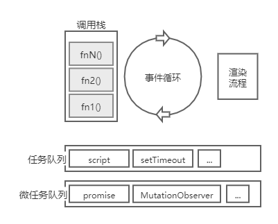
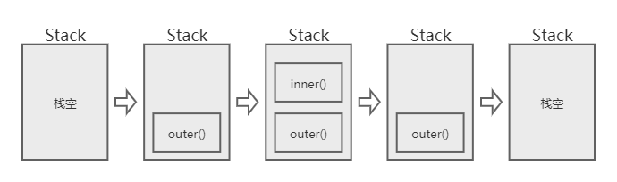

```js
console.log('脚本执行开始')

setTimeout(function () {
  console.log('setTimeout 执行')
}, 0)

new Promise((resolve, reject) => {
  console.log('promise')
  resolve()
})
  .then(function () {
    console.log('promise then 1 执行')
  })
  .then(function () {
    console.log('promise then 2 执行')
  })

console.log('脚本执行结束')
```

结果:
```
脚本执行开始
promise
脚本执行结束
promise then 1 执行
promise then 2 执行
setTimeout 执行
```

## 事件循环

为了理解上面代码执行背后发生了什么，就必须从浏览器的[事件循环](https://html.spec.whatwg.org/multipage/webappapis.html#event-loops)开始说起。

首先，大家应该无数次听说过，JavaScript 本身是单线程的，所以同一时间内只能同步处理处理一件事情，异步本身并不是 JavaScript 的一部分。这个限制从好的方面来说，简单的模型可以让我们不用考虑过多的复杂性，大大简化编写程序的难度。

但换个角度，假如浏览器中的所有逻辑代码都只能连续、顺序排队同步执行下去，那么代码中的许多费时操作将会处处导致线程被阻塞住，用户的操作将很难得到及时的响应。想象一下，用户的鼠标点击，滚轮滚动，文字录入，都要等几秒后才能有响应，那是怎么样的一种景象。很显然，Web 应用将变得完全不可用。

于是，我们迫切地需要一种异步的执行模型来解决这个问题。

而 “事件循环（Event loop）” 就是这个问题的答案。浏览器使用事件循环来协调事件、用户交互、脚本、渲染、联网等，用其来实现一种不阻塞的并发模型。

> NodeJS 中也有自己的一套事件循环的实现。
> 浏览器中，window 和每个 worker 线程，都有自己独立的一套 EventLoop，互不干扰。

那么，事件循环又是怎么一回事呢？

<!-- more -->

## 任务队列

简单来说，事件循环，就是浏览器将要执行的代码，划分成一个个任务，然后通过某种机制调度这些任务的执行的一整套机制。

既然存在许多多个任务要执行，为了保证能按照某种顺序被调度执行，那么就需要用一种类似队列的数据结构来存储它们。

按照两种不同的调度方式，分别存在两类任务队列，分别为：

1. 任务队列 Task queue
2. 微任务队列 Microtask queue

> 规范中并没有使用“微任务（Microtask）”这个术语，为了方便区分，后续将继续这么称呼。
> 这里明确地用到“队列”这个术语，只是为了方便理解，具体的实现是否为队列并不重要。
> 队列可以有多个，用来归类不同的任务源（后面会说到）的任务，以实现各类任务的调度优先级，以及确保同类任务的调用顺序不乱。
> 一个浏览器进程中，不同的线程（如 Window，和 Worker），有自己的 EventLoop，不互相干扰。

各种任务产生出来之后，就会被放入上述两类的各种队列中，然后等待事件循环调度执行。

事件循环本身的核心实现大致实现如下：

```js
while (queue.waitForMessage()) {
  queue.processNextMessage()
}
```

就是一个简单的永不歇的任务读取执行循环，这也是事件循环的得名原因。

## 任务执行



具体到每一轮循环：

1. 将会从任务队列中取出一个任务，调用执行，形成对应的调用栈，执行到栈空，任务也就执行完毕了。
2. 每次栈空，就会执行一下微任务检查点算法（perform a microtask checkpoint algorithm），用于确定是否要执行微任务队列。
3. 如果需要执行微任务队列，则*一次性全部*连续执行完，之后可能清理 indexed Database 事务。
4. 之后是可选的渲染流程（如果有渲染机会），渲染流程中，会调用 rAF 的回调，然后进行 Layout、Paint，之后还有时间就执行 rIC 回调。

以上就是一轮完整的事件循环，周而复始，继续下一轮的事件循环。

> 本文所有描述都是基于 chrome 浏览器的情况，因为其他浏览器有些实现可能有微妙的区别。
> 如果上述过程中，代码的执行创建了新的任务或者微任务，将会被放入对应的任务队列中。
> 对于任务，需要按照顺序等待某次事件循环取出执行。而对于微任务，则再本轮任务循环中，会全部执行完毕。因此，如果在微任务的执行过程中，不停的创建新的微任务，那么可能会导致出现死循环。
> 如果在 rAF 回调里面注册新的 rAF callback，会在下一次渲染过程中才执行，而不会在本次渲染过程中执行，所以不会出现死循环。
> rIC（requestIdleCallback）的回调是在渲染过程的末段（Layout 、Paint 之后），如果还有剩余时间，才执行。

## 栈

上面说到任务执行完毕的时候，提到栈的概念，所以这里略作说明。

每次函数调用，就会形成一个由若干帧组成的栈。每个嵌套的函数调用，都会在这个栈上压入新的一个栈帧，而每个函数调用返回的时候，都会弹出对应的栈帧。
所以函数的调用过程，就是调用栈在叠高和移除的过程，一旦栈空了，也就意味着整个函数调用结束了。

> 通过 chrome 的开发者工具，可以观察到各种函数的调用情况，感兴趣的可以多研究下。

举例说明：

```js
function inner(n) {
  const m = 1
  return n + m
}

function outer(x) {
  const y = 2
  return inner(x + y)
}

console.log(outer(2)); // 返回 5
```

`outer(2)` 调用的过程栈的变化情况如下:



1. 当 `outer` 调用时，第一个帧被创建并压入栈中，帧中包含了 `outer` 的参数和局部变量。
2. 当 `outer` 调用 `inner` 时，第二个帧被创建并被压入栈中，放在第一个帧之上，帧中包含 `inner` 的参数和局部变量。
3. 当 `inner` 执行完毕然后返回时，第二个帧就被弹出栈（剩下 `outer` 函数的调用帧 ）。
4. 当 `outer` 也执行完毕然后返回时，第一个帧也被弹出，栈就被清空了。

每次执行到栈空的时候，就会执行一下微任务检查点逻辑（后面会提到），如果有需要执行的微任务，就会一次性全部执行完毕。


## 任务的结构

整个事件循环中，可能涉及到各种各样的任务，我们对任务，可以抽象理解成如下的结构：

- 步骤（Steps）：一系列步骤指定任务要完成的工作。
- 源（Source）：任务来源之一，用于对相关任务进行分组和序列化。
- 文档（Document）：与任务关联的文档，非 window 中则为 null。
- 脚本求值环境设置对象集（A script evaluation environment settings object set）：一系列用于任务过程追踪脚本求值的环境设置对象的集合。

不同的任务中，封装了负责各种工作的算法，比如说：

- 事件 (events)
在特定的某个 EventTarget 上派发 Event 对象，例如鼠标的 click 事件，通常由专门的 task 来完成。
> 注，并非所有事件都是使用 task queue 来派发。

- 解析（Parsing）
例如解析 HTML。

- 回调（Callbacks）
回调通常也使用专门的 task 来完成。

- 使用资源（Using a resource）
当算法获取资源时（ajax），如果获取是以非阻塞方式发生的，则一旦部分或全部资源可用，则对资源的处理将由任务来执行（回调）。

- 响应 DOM 操作（Reacting to DOM manipulation）
一些元素的 task 会响应 DOM 操作而触发，例如，当该元素被插入到 `document` 时。

### 任务源

每个 task 在其 `source` 中定义了，来自特定的 `task source`。
在每个事件循环中，每个 `task source` 都必须与特定的 `task queue` 关联。
这个 source 有什么用呢？主要可以用于区分不同的任务，将某类 source 的归类到一种任务队列中，而另外一些则归入其他任务队列中。这么做，方便实现不同的事件拥有不同的调度优先级。但这些都是旁支末节的东西，不再深究。

大致存在以下这些任务源：

1. DOM 操作任务源
  该 task source 用于响应 DOM 操作的功能，例如在将元素插入文档中时以非阻塞方式所发生的事情。
2. 用户交互任务源
  此任务源用于响应用户交互的功能，例如键盘或鼠标输入的事件回调。
3. 网络任务源
  此任务源用于响应网络活动而触发的功能，如 XHR 回调。
4. 历史遍历任务源（The history traversal task source）
  此任务源用于对 history.back（）和类似 API 的调用排队

总结来说，常见的 task 任务有：
1. IndexedDB 数据库操作等 I/O
2. setTimeout / setInterval
3. history.back

对于任务的队列划分情况，大致如下，

任务队列：
- 全部 js 代码，同步代码，比如一个 script 标签里的所有代码
- setTimeout, setInterval, setImmediate 等计时器的回调函数
- I/O 操作结果回调函数
- UI rendering

微任务队列：
- process.nextTick 回调函数
- Promises，如果 promise 状态是 resolve、reject，那就放入当前事件循环的 microtask quene 中，如果是 pending，则放入未来的 microtask quene 中。
- Object.observe（注：该特性已经在标准中废除）
- MutationObserver


### 任务关联的文档

每个任务都有个关联的文档，这跟渲染流程有关系，比如可以用于判断浏览上下文是否应该渲染等等。
这也是旁支末节的东西，不再深究，感兴趣可以参阅标准文档的相关章节。


## 浏览器渲染

事件循环过程中，可能会进入渲染流程。这里用到了“可能”一词，是因为是否渲染取决于是否有渲染的机会，而渲染机会是周期性出现的。

简单来说，如果当前是一个 window 的事件循环，综合硬件限制（例如显示刷新率）和其他因素（例如页面性能或页面是否在后台）等因素，来确定是否需要进行渲染。

理想的情况，应当跟浏览器的刷新率一致，每秒有 60 个刷新机会，以维持最流畅的画面，超出屏幕刷新率的渲染都是一种浪费，所以大部分情况下，浏览器是通过合成线程收到垂直同步信号后，才着手开始新的一帧，从而有节制地进行渲染。

但是，如果硬件性能不行，根本没法维持住 60Hz 的刷新率，那么就没有必要坚持每 16.7ms 刷新一次，浏览器可以选择降低到每分钟 30 个渲染机会，而不是出现偶尔丢帧。

另外，在页面当前不可见的情况，就更没有必要维持一个很高的刷新频率，徒增能耗，浏览器可能就会将页面放慢到每秒 4 个甚至更少的渲染机会。

不管如何，一旦进入渲染流程，浏览器会先处理输入事件，例如 resize、scroll，然后调用 raf 的回调（这些回调的调用栈空后，又会触发微任务检查点算法，清理 Microtask queue），再后面就是计算 Style，Layout，Paint，然后合成，然后 Commit 帧，在完成一帧之后如果还有空闲，那还会处理 requestIdleCallback 的回调。

渲染只是事件循环过程的一个小环节，因此此处也不再深究。

## 开头问题解释

了解了整个事件循环的机制后，现在就可以来分析开头的代码了。

1. 首先整个脚本代码，作为一个任务被执行。
2. 执行 `console.log('脚本执行开始')`, 结果在屏幕打印 '脚本执行开始'
3. 执行 `setTimeout`, 设置定时器（定时器时间到了之后，会在任务队列中，添加一个新任务用于执行定时器回调）。
4. 执行 new Promise 的回调，在屏幕打印 'promise'。
5. Promise resolve，第一个 then 回调作为一个任务添加进微任务队列。
6. 执行 `console.log('脚本执行结束')`，在屏幕打印 '脚本执行结束'。
7. 此时第一个任务（同步脚本代码）执行完毕。
8. 开始执行微任务，当前微任务队列里有一个任务，拿出执行，执行结果为打印 'promise then 1 执行'，之后相当于 resolve 为 undefined，添加第二个 then 的回调到微任务队列。
9. 由于微任务队列里新添加了一个任务，所以继续拿出执行，打印 'promise then 2 执行'。
10. 微任务队列已经清空，此时可能进行渲染流程。
11. 继续后续的事件循环。
12. 定时器产生的新任务被新一轮的事件循环取出执行，打印 'setTimeout 执行'。
13. 没有任务了，事件循环继续等待下个任务。


## 参考
[Event loops](https://html.spec.whatwg.org/multipage/webappapis.html#event-loop)

---

全文完
