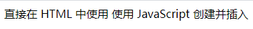
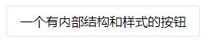
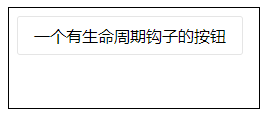
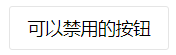
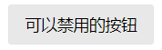
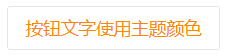

## Web Component

写一个 Web Component 很简单，只需要书写一个继承 `HTMLElement` 的 `class` 即可，比如我们打算创建一个自定义的按钮元素：

```js
class MyButton extends HTMLElement {}
```

然后为了可以在 HTML 中使用，以及可以使用 `document.createElement` 来创建元素，我们还需要注册下这个组件，分配一个元素名称。

```js
if (!customElements.get('my-button')) {
  customElements.define('my-button', MyButton)
}
```

然后试试效果：

```html
<my-button>直接在 HTML 中使用</my-button>

<script>
// 或者使用 JavaScript 创建并插入
const $p = document.createElement('my-button')
$p.innerHTML = '使用 JavaScript 创建并插入'
document.body.appendChild($p)
</script>
```

页面上如愿显示出内容：



---

## Shadow DOM

如果只是一个长得不像按钮，光秃秃的自定义元素，那根本就派不上用场。
按钮的功能先不论，首先组件内部总该可以封装自己的内容和样式，这是作为一个组件的最基本的需求之一。
于是，这个时候 Shadow DOM 就可以上场了。

让我们改造下代码，使用 Shadow DOM 为我们的自定义 Button 加上内部 DOM 结构：

<!-- more -->

```js
// 创建一个模板，内容是我们的样式和按钮的内部 DOM 结构，
// 使用模板是为了实例化的时候可以直接 cloneNode，而不用每次都人工创建这些节点以提高性能和方便维护
const STYLE = `
<style>
:host {
  display: inline-block;
  box-sizing: border-box;
  padding: 8px 16px;
  border: 1px solid #e5e5e5;
  border-radius: 3px;
  cursor: pointer;
}
</style>`

const HTML = `
<div id="layout">
  <slot></slot>
</div>
`
const template = document.createElement('template')
template.innerHTML = STYLE + HTML

class MyButton extends HTMLElement {
  constructor() {
    super()
    // 附加一个 shadow root
    const shadowRoot = this.attachShadow({mode: 'open'})
    // 在 shadow root 上，插入我们需要的 DOM 节点
    shadowRoot.appendChild(template.content.cloneNode(true))
  }
}
```

然后先看看效果：

```html
<my-button>一个有内部结构和样式的按钮</my-button>
```

页面显示：



已经有按钮的样子了。

那么将眼光放回代码部分，出现了几个奇怪的东西，首先是 CSS 中的 `:host`，还有 HTML 中的 `slot`，这些都是什么鬼？

关于第一个问题，要解释几个新的概念：

- shadow host，这是我们的 Shadow DOM 所附身的宿主元素，在这个例子中，就是我们的 `MyButton` 元素。
- shadow tree，Shadow DOM 内部的 DOM 树。
- shadow root，Shadow tree 的根节点。

我们在构造器里面，为 `MyButton` 附加了一个 shadow DOM，那么，`MyButton` 本身即为 `host`。
在样式中，可以通过 `:host` 伪类来为这个宿主设置样式，通过这种方式设置的样式优先级低于外部设置的，以便作为默认样式提供，又便于外部设置样式覆盖。

> 需要注意的是，如果宿主元素需要结合其他特定的选择器，那么需要写成伪类函数的形式，例如: `:host(:hover)`，而非 `:host:hover`。

我们在例子中，我们在 Shadow DOM 内部，插入了一个 style 标签，以及按钮的内部 DOM 结构，DOM 结构中的 slot 标签，是为了内容分发用的。我们在使用组件时，组件的 innerHTML，插入的位置就是 slot。这里顺便提一下，还有一种具名的 slot，这里不再展开。

> 如果使用过 Vue 等前端库的朋友可能会觉得很眼熟，实际上 Vue 的设计也是在向标准的 Web Component 靠拢，它们基本就是扮演一样的功能，都是内容分发。

最后，关于 `attachShadow` 的选项，也有些有用的配置，感兴趣的可以去看文档学习使用，这里只简单提下 `mode`，我们用了 `'open'` 这个值，这代表我们可以通过 JavaScript 来访问 Shadow DOM，还有个值为 `'closed'`，如果用了这个值，我们就要再组件内部自己保存对 shadow root 的引用，以便访问。

---

## 生命周期钩子

讨论组件就免不了要涉及到生命周期钩子，Web Components 也同样有自己的生命周期钩子，尽管比较简单，有下面这几个：

- `connectedCallback`
- `disconnectedCallback`
- `adoptedCallback`
- `attributeChangedCallback`

其中关键的就只有前面两个和最后一个，第一个是自定义元素被插入到文档时执行，其实就是 mounted；第二个是自定义元素从文档中脱离时执行，就是 unmounted。

需要注意的是，这两个钩子，每次插入和移除的时候，都会执行。

所以只需要执行一次并且无需清理的操作，应当放在 `constructor` 中做；而需要清理的操作，则放在 `connectedCallback` 中做，并在 `disconnectedCallback` 中清理。

另外，许多在元素插入后才有意义的工作，也可以放在 `connectedCallback` 中来做。
而有一些元素移除的时候需要清理的工作，则应当在 `disconnectedCallback` 中处理，因为并没有 `destroy` 之类的钩子。

至于 `adoptedCallback`，是在元素被插入到其他文档时调用的，这个用得不多，不做深究。
而 `attributeChangedCallback` 就非常重要了，后面再展开。

举个例子说明这些生命周期钩子的执行情况，继续改造我们的 MyButton：

```js
class MyButton extends HTMLElement {
  constructor() {
    super()
    const shadowRoot = this.attachShadow({mode: 'open'})
    shadowRoot.appendChild(template.content.cloneNode(true))
  }
  connectedCallback() {
    console.log('按钮已经插入到文档 DOM 树')
  }
  disconnectedCallback() {
    console.log('按钮已经从文档 DOM 树中脱离')
  }
  adoptedCallback() {
    console.log('按钮被插入到其他文档')
  }
}
```

试试看：

```html
<iframe style="width:250px;height:100px;border:1px solid #000;"></iframe>

<script>
const $myButton = document.createElement('my-button')
$myButton.innerHTML = '一个有生命周期钩子的按钮'

// 执行该行，将按钮插入 DOM，会调用 connectedCallback，打印出 '按钮已经插入到文档 DOM 树'
document.body.appendChild($myButton)

// 执行该行，会触发三个钩子，
// 1. 将按钮从 DOM 树中移除， 触发 disconnectedCallback，打印出 '按钮已经从文档 DOM 树中脱离'
// 2. 然后按钮被移动到 iframe 中，触发 adoptedCallback，打印出 '按钮被插入到其他文档'
// 3. 按钮在 iframe 中插入成功，触发 connectedCallback，打印出 '按钮已经插入到文档 DOM 树'
frames[0].document.body.appendChild($myButton)
</script>
```

显示效果：



有了生命周期钩子，就可以做很多事情了，但是我们的例子比较简单，暂时先不深入使用。

---

## attribute 和 property

为了拥有按钮该有的一些交互，我们准备实现一个 `disabled` 属性，用于控制按钮是否可以点击。

首先，由于翻译的问题，HTMLElement 上的 “属性”，可能指的是 attribute 或 property，区别也很简单，如下例子代码：

```html
<!-- attribute-name 即为一个 attribute -->
<my-element attribute-name="attribute-value"></my-element>

<script>
  const $myEl = document.querySelector('my-element')

  // attribute 通过专门的 api 读写
  $myEl.getAttribute('attribute-name') // 'attribute-value'

  // attributeName 即为 property，值可以是任何 JavaScript 合法值，通过 '.' 语法直接读写
  $myEl.attributeName = 'Any JavaScript value'
</script>
```

其中 attribute 可以在 HTML 上直接书写，也因此限定了只能是字符串形式，而 property 则自由得多，可以用 JavaScript 读写。
在 HTMLElement 中，许多 attribute，都有一一对应的 property 关联。我们自己实现的组件，也可以做到这一点，只需要同时定义一套 attribute 以及 property，并且在他们变化的时候，同步更新另一个即可。

接下来就为我们的组件逐步新增 attribute 以及 property。

---

## 使用 attribute

开始添加 `disabled` 的 attribute，为了看到效果，我们还同时需要修改 STYLE 部分：

```js
const STYLE = `<style>
:host {
  display: inline-block;
  box-sizing: border-box;
  padding: 8px 16px;
  border: 1px solid #e5e5e5;
  border-radius: 3px;
  cursor: pointer;
}
:host([disabled]) {
  background: #e8e8e8;
  cursor: not-allowed;
}
</style>`
```

然后组件部分的改造：

```js
class MyButton extends HTMLElement {
  // 注意此处为关键代码
  static get observedAttributes() {
    return ['disabled']
  }

  constructor() {
    super()
    const shadowRoot = this.attachShadow({mode: 'open'})
    shadowRoot.appendChild(template.content.cloneNode(true))

    // disabled 状态，阻止点击，使用捕获模式，以早于外部绑定的事件触发。
    this.addEventListener('click', (e) => {
      if (this.hasAttribute('disabled')) {
        e.preventDefault()
        e.stopImmediatePropagation()
      }
    }, true)
  }

  // 注意此处为关键代码
  attributeChangedCallback(attrName, oldVal, newVal) {
    if (attrName === 'disabled') {
      console.log(newVal === null ? '按钮禁用了' : '按钮启用了')
    }
  }

  connectedCallback() {/* 略 */}
  disconnectedCallback() {/* 略 */}
  adoptedCallback() {/* 略 */}
}
```

注意代码中，我们增加了一个静态的 getter，它的作用是，让组件观察指定的 attribute 变化，以便在前文提到的 `attributeChangedCallback` 钩子中，得知并处理这些变化。

我们再试试效果：

```html
<my-button>可以禁用的按钮</my-button>
<script>
  const $myButton = document.querySelector('my-button')
  $myButton.onclick = e => {
    console.log('按钮被点击了')
    $myButton.setAttribute('disabled', '')
  }
</script>
```

鼠标点击前：



鼠标点击，控制台输出：

```
按钮被点击了
按钮启用了
```
且效果切换成禁用状态：



之后按钮被禁用，再次怎么点击也不会有输出了。

---

## 使用 property

添加了 attribute 后，我们再为 `MyButton` 新增一个同名的 property，这个改造比较容易，只需要写一对存取器即可。

```js
class MyButton extends HTMLElement {
  static get observedAttributes() {
    return ['disabled']
  }

  // 关键代码
  get disabled() {
    return this.hasAttribute('disabled')
  }
  // 关键代码
  set disabled(value) {
    if (value === null || value === false) {
      this.removeAttribute('disabled')
    }
    else {
      this.setAttribute('disabled', '')
    }
  }

  constructor() {
    super()
    const shadowRoot = this.attachShadow({mode: 'open'})
    shadowRoot.appendChild(template.content.cloneNode(true))

    // disabled 状态，阻止点击，使用捕获模式，以早于外部绑定的事件触发。
    this.addEventListener('click', (e) => {
      if (this.hasAttribute('disabled')) {
        e.preventDefault()
        e.stopImmediatePropagation()
      }
    }, true)
  }

  attributeChangedCallback(attrName, oldVal, newVal) {
    if (attrName === 'disabled') {
      console.log(newVal === null ? '按钮禁用了' : '按钮启用了')
    }
  }
  connectedCallback() {/* 略 */}
  disconnectedCallback() {/* 略 */}
  adoptedCallback() {/* 略 */}
}
```

这样一来，通过设置 `disabled` property，即可对应修改 attribute 的值，功能完美实现。

值得注意的是，对于 property 存取器，可能在 Web Component 的 prototype 还没有链接到实例之前，就已经设置了 property，这种情况，组件的 property 的 setter 逻辑将不会执行。

下面使用一个简单的例子说明：

```html
<prop-test></prop-test>
<script>
  // property 的赋值早于组件的定义
  document.querySelector('prop-test').prop = 'prop'
  // 组件定义
  customElements.define('prop-test', class PropTest extends HTMLElement {
    get prop() {
      return this._prop
    }
    set prop(value) {
      this._prop = value
      console.log('此 setter 不会执行')
    }
  })
</script>
```

不过这种情况很多时候都可以通过 delete 属性，再重新赋值而修复：

```html
<prop-test></prop-test>
<script>
  document.querySelector('prop-test').prop = 'prop'
  customElements.define('prop-test', class PropTest extends HTMLElement {
    get prop() {
      return this._prop
    }
    set prop(value) {
      this._prop = value
      console.log('此 setter 将正常执行')
    }

    constructor() {
      super()
      // delete 后重新设置 'prop'
      upgradeProperty(this, 'prop')
    }
  })

  // 重新设置 property
  function upgradeProperty(element, prop) {
    if (element.hasOwnProperty(prop)) {
      const value = element[prop]
      delete element[prop]
      element[prop] = value
    }
  }
</script>
```

至此，我们的 web component 就拥有了与外部通讯的能力，可以通过 attribute 和 property 接受外部输入。

但如果想往外传递数据呢？这时候就需要借助事件机制了。

---

## 事件

Web components 跟普通 html 元素一样，支持各种各样的 DOM 事件。

除此之外，我们也可以根据需要使用 `CustomEvent` 构造各种自定义事件，并且可以通过参数中的 `detail` 属性携带各类事件数据：

```js
const event = new CustomEvent('my-event', {
  // 用来传递数据
  detail: { payload: 'anything' }
})
```

构造好数据后，可以使用 `EventTarget.dispatchEvent` 进行派发：

```js
// 跟普通 DOM 事件一样，监听
document.addEventListener('my-event', event => {
  console.log('my-event, payload:', event.detail.payload)
})

// 派发事件
document.dispatchEvent(event) // 打印：'my-event, payload: anything'
```

以上例子简单地演示了自定义事件的用法。

但是在 web component 中，不论是原生 DOM 事件，还是自己派发的自定义事件，都没这么简单，需要考虑事件是否能穿透 Shadow DOM 边界的问题。

派发 CustomEvent 时，可以通过 `bubbles` 和 `composed` 这两个布尔选项来控制冒泡的行为：

```js
const event = new CustomEvent('my-event', {
  payload: 'anything',
  // 表示事件会冒泡
  bubbles: true,
  // 表示冒泡可以穿过 Shadow DOM 的边界，一直传递到组件外部
  composed: true,
})
```

属性 `bubbles` 比较好理解，就是开关是否冒泡，而 `composed` 的具体效果又是怎么样的呢，用一个例子看看：

```html
<event-test></event-test>
<script>
  // 监听自定义事件
  document.addEventListener('test-event', event => console.log(event.detail))

  customElements.define('event-test', class EventTest extends HTMLElement {
    constructor() {
      super()
      this.attachShadow({ mode: 'open' })
      const $inner = document.createElement('div')
      $inner.innerHTML = 'Event Target'
      this.shadowRoot.appendChild($inner)

      // 派发事件
      $inner.dispatchEvent(new CustomEvent('test-event', {
        bubbles: true,
        composed: false,
        detail: 'composed false',
      }))
      $inner.dispatchEvent(new CustomEvent('test-event', {
        bubbles: true,
        composed: true,
        detail: 'composed true',
      }))
    }
  })
</script>
```

上面代码中，我们派发了两个自定义事件，但是控制台只会打印出一个 'composed true'。这意味着，只有设置了 `composed` 为 `true` 的事件，穿过了 Shadow DOM，冒泡到 `document` 上了，而设置为 false 的，就只能在 Shadow DOM 内部传播了。

对于 UI 事件的 `bubbles` 和 `composed` 情况，可以参考[文档](https://www.w3.org/TR/uievents/)。

如下这些常见的事件，`composed` 为 `true`：
`blur`，`focus`，`focusin`，`focusout`，`click`，`dblclick`，`mousedown`，`mouseup`， `mousemove`，`mouseout`，`mouseover`，`wheel`，`beforeinput`，`input`，`keydown`，`keyup`。

而这些常见的，则为 `false`：
`mouseenter`，`mouseleave`，`load`，`unload`，`abort`，`error`，`select`，`slotchange`。

还有一个需要注意的点，web component 的 Shadow DOM 内部节点触发的事件，对于外部脚本来说，事件目标将会被重定向为 host 元素，因为外部程序不需要也不应该了解组件内部的情况，以免破坏封装性。不过 slotted 的元素触发的事件则不会重定向 target，因为它们本来就存在于外部。

至此，写一个 Web Component 的主要知识点都简单提到了，对于简单的组件，基于这些知识背景，已经可以尝试写一写了。

不过，各种基础的组件通常需要组织成一个库，而不是孤立的，而一套组件，就需要有一致的主题样式了。

## 主题

对于 Web Component 的主题样式，可以通过 CSS 的变量来实现。

例如我们的按钮组件，需要增加一个颜色变量：

```js
const STYLE = `<style>
:host {
  display: inline-block;
  box-sizing: border-box;
  padding: 8px 16px;
  border: 1px solid #e5e5e5;
  border-radius: 3px;
  cursor: pointer;
  color: var(--fg-color, #000);
}
:host([disabled]) {
  background: #e8e8e8;
  cursor: not-allowed;
}
</style>`
```

注意 `color: var(--fg-color, #000)` 这一行：

- `var()` 代表使用变量。
- `--fg-color` 代表使用的变量名称，注意变量用 `--` 开头。
- `#000` 是默认值，默认值也可以是变量，也可以有多个默认值。

STYLE 这样改造后，外部怎么提供主题设置呢？

最简单的方法是，提供一套全局的主题设置，如：

```css
:root {
  --fg-color: #f80;
  /* 在此配置所有变量的值 */
}
```

效果：



此外，变量也可以局部作用域设置，跟写普通 CSS 差不多：

```css
my-button {
  --fg-color: #f80;
}
```

还有内联 style:

```html
<my-button style="--fg-color:#f80;">内联样式</my-button>
```

以及 JavaScript 操作：

```js
$myButton.style.setProperty('--fg-color', '#f80')
```

等等。

## 最后

如果感兴趣的话，可以访问我开源的一个 Web Component 组件库：

[blocks](https://dawenci.me/blocks/)
