## CORS 相关响应头

在进行 CORS 相关的配置时，通常需要一些以 `Access-Control` 开头的响应头，比如：

- `Access-Control-Allow-Origin`
- `Access-Control-Allow-Methods`
- `Access-Control-Allow-Headers`
- `Access-Control-Allow-Credentials`
- `Access-Control-Expose-Headers`
- `Access-Control-Max-Age`

要理解这些 header 的作用，可以直接动手通过一个简单的实验来辅助理解。

实验代码的后端部分，基于 node + express。下面正式开始。

<!-- more -->

## 简单的 GET 跨域请求

首先，编写一个简单的接口服务，提供简单的路由，监听 `127.0.0.1` 的 `3000` 端口。代码如下：

```js
const express = require('express')
const app = express()

app.get('/test', (req, res) => {
  res.send('GET_TEST')
})

app.listen(3000, () => {
  console.log(`Example app listening on port 3000`)
})
```

然后，我们使用浏览器，在 `localhost` 的其他端口，跨域运行请求代码，我们的例子运行在 `http://localhost:8080`（即 origin），请求代码如下：

```js
fetch('http://127.0.0.1:3000/test')
  .then(res => res.text())
  .then(console.log)
```

代码执行后，观察 chrome 浏览器的网络面板，如下图，

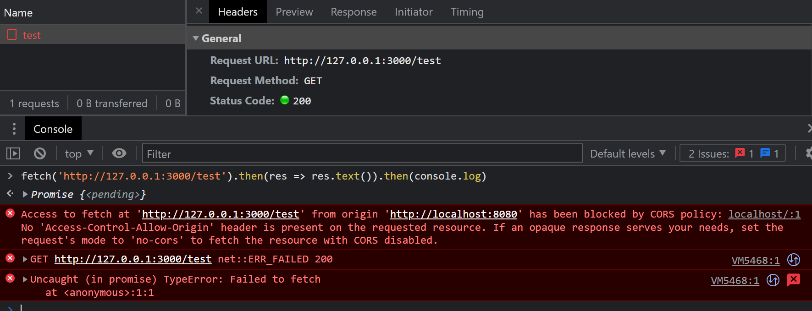

我们可以看到服务端响应 200 OK，但是控制台同时会报告一个 CORS error，并拒绝提供响应体给用户，错误内容如下：

```
Access to fetch at 'http://127.0.0.1:3000/test' from origin 'http://localhost:8080' has been blocked by CORS policy: No 'Access-Control-Allow-Origin' header is present on the requested resource. If an opaque response serves your needs, set the request's mode to 'no-cors' to fetch the resource with CORS disabled.
```

从这个错误提示中，我们也可以知道，问题的关键在于 `Access-Control-Allow-Origin` 头。这个头信息用于指明允许的 `Origin`，其值可以是通配符 `*`。我们改造下服务端代码：

```js
const express = require('express')
const app = express()

// 新增该中间件代码
app.use((req, res, next) => {
  res.header('Access-Control-Allow-Origin', '*')
  next()
})

app.get('/test', (req, res) => {
  res.send('GET_TEST')
})

app.listen(3000, () => {
  console.log(`Example app listening on port 3000`)
})

```

通过一个 Express 中间件，为每个响应都附加上 `Access-Control-Allow-Origin` 头，并将值设置为 `*`，再试试发送同样的请求，结果如图

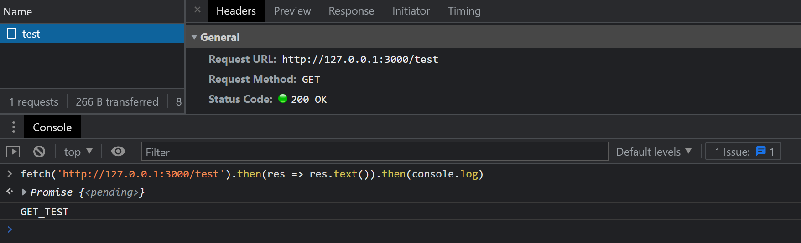

可以看到结果正确打印出：

```
GET_TEST
```

## 更多跨域请求方法

以上最简单的情况通过了，那么对于 PUT、DELETE 等需要 通过 OPTIONS 请求进行预检（Preflight）的 HTTP 方法呢？  

> 关于 Preflight request 请看文末参考资料

我们用 `PUT` 请求做一次测试，先改造服务端代码，加上一个新的路由：

```js
app.put('/test', (req, res) => {
  res.send('PUT_TEST')
})
```

再从浏览器发送请求：

```js
fetch('http://127.0.0.1:3000/test', { method: 'PUT' })
  .then(res => res.text())
  .then(console.log)
```

网络面板中，可以观察到两个请求，其中一个是 OPTIONS 请求预检，一个失败的 PUT 请求：
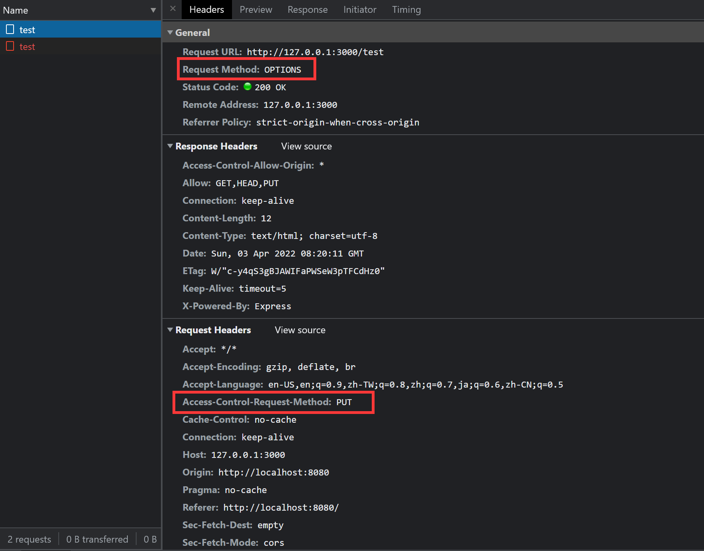
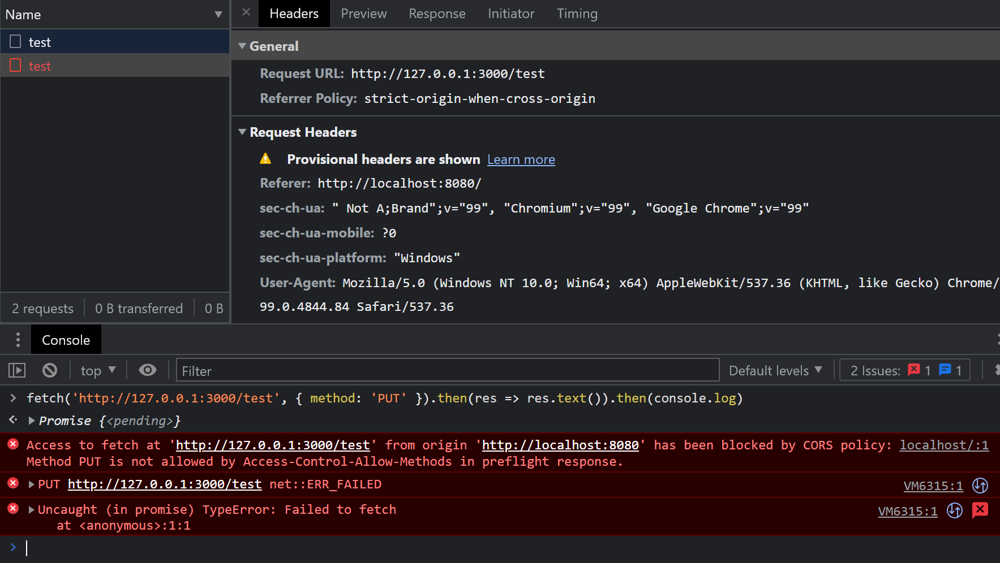

错误信息：

```
Access to fetch at 'http://127.0.0.1:3000/test' from origin 'http://localhost:8080' has been blocked by CORS policy: Method PUT is not allowed by Access-Control-Allow-Methods in preflight response.
```

从错误信息中可以得知，预检的响应中，`Access-Control-Allow-Methods` 中没有对 `PUT` 的许可，因此被阻止了。

所以，我们改造下中间件，加上这个响应头，把 `PUT` 方法加上：

```js
app.use((req, res, next) => {
  res.header('Access-Control-Allow-Origin', '*')
  res.header('Access-Control-Allow-Methods', 'PUT')
  next()
})
```

再次尝试发送请求，结果如下图：

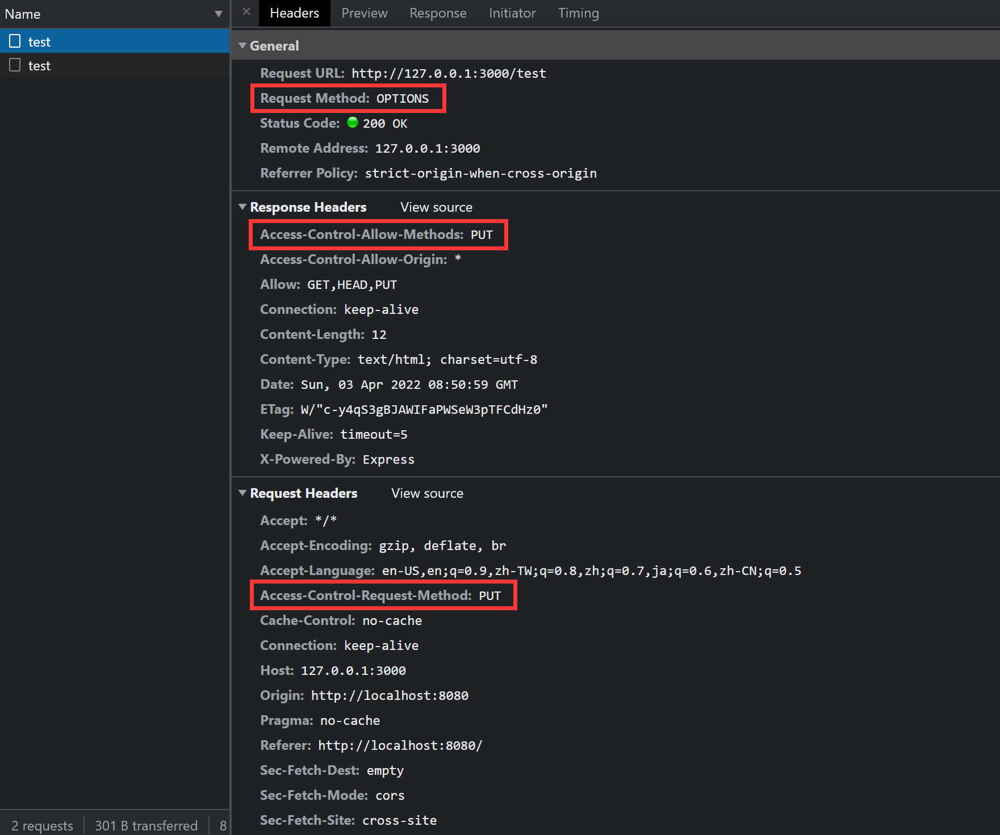
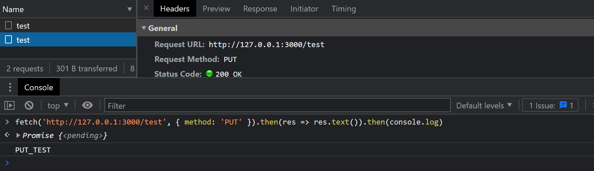

这回，就没有报错，可以成功获得结果了：

```
PUT_TEST
```

至此，我们通过设置这两个响应头，就可以支持各种各样的 HTTP 方法了。


## 自定义 Headers

如果我们想更进一步，在请求的时候，通过附加一些自定义的请求头，用于给服务端传递额外信息，例如我们想传递一个 `x-requested-with` 头：

```js
fetch('http://127.0.0.1:3000/test', {
  headers: {
    'x-requested-with': 'XMLHttpRequest'
  }
})
  .then(res => res.text())
  .then(console.log)
```

此时的结果：


由于我们使用了自定义的请求头，所以需要发起预检检查服务端是否支持，观察错误消息：

```
Access to fetch at 'http://127.0.0.1:3000/test' from origin 'http://localhost:8080' has been blocked by CORS policy: Request header field x-requested-with is not allowed by Access-Control-Allow-Headers in preflight response.
```

很显然，服务端并不支持该请求头，解决的方法，就是要附加上 `Access-Control-Allow-Headers` 响应头告诉客户端支持，继续改造我们的中间件：

```js
app.use((req, res, next) => {
  res.header('Access-Control-Allow-Origin', '*');
  res.header('Access-Control-Allow-Methods', 'PUT')
  res.header('Access-Control-Allow-Headers', 'x-requested-with')
  next()
})
```

再次发送请求，结果如下图：

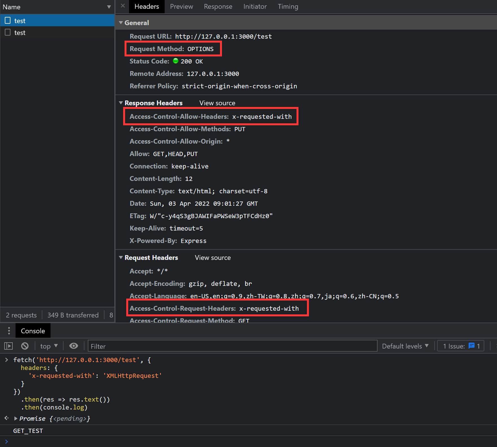

问题消除，再次正确打印信息。

既然发送特别的请求头给服务端，需要如此周折，那反过来，如果客户端也想读取一些服务端自定义的响应头呢？

继续测试，服务端代码我们加上一个路由：

```js
app.get('/header', (req, res) => {
  res
    .header('test-header', 'test-header-value')
    .send('header')
})
```

再从浏览器发起请求看看：

```js
fetch('http://127.0.0.1:3000/header')
  .then(res => {
    console.log(res.headers.get('test-header'))
  })
```

结果如图：

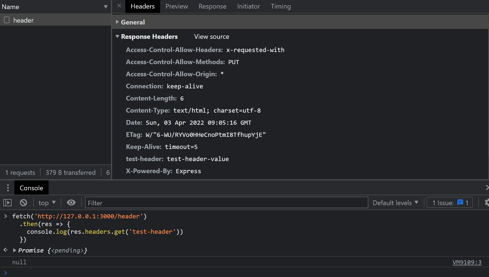

打印出了 `null`，而网络面板的 Response Headers 里，也没有这个 `test-header` 头。

这时，就到了 `Access-Control-Expose-Headers` 出场了，需要暴露给用户的响应头，需要在这里指明，我们改造中间件：

```js
app.use((req, res, next) => {
  res.header('Access-Control-Allow-Origin', '*');
  res.header('Access-Control-Allow-Methods', 'PUT')
  res.header('Access-Control-Allow-Headers', 'x-requested-with')
  res.header('Access-Control-Expose-Headers', 'test-header')
  next()
})
```

再次测试，结果：
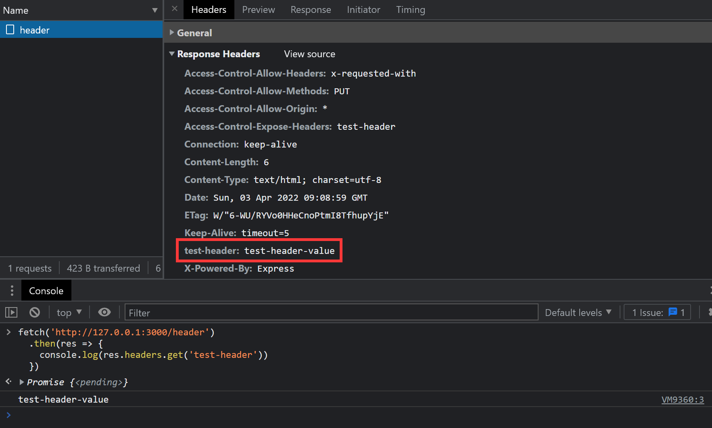

正确打印出 `test-header-value`，网络面板中也出现了该 header。


## Credentials

假如我们又有了一个新的需求，需要在请求的时候，附加上 cookie 信息（或 authorization headers 或 TLS client certificates），这时候，就要将 `credentials` 模式改成 `include`。请求代码如下：


```js
fetch('http://127.0.0.1:3000/test', {
  credentials: 'include'
})
  .then(res => res.text())
  .then(console.log)
```

> 注，如果用 `XMLHttpRequest` ，则可以如下：
>```js
> const xhr = new XMLHttpRequest()
> xhr.open('GET', 'http://127.0.0.1:3000/test', true)
> xhr.withCredentials = true
> xhr.send(null)
>```

结果如下图：
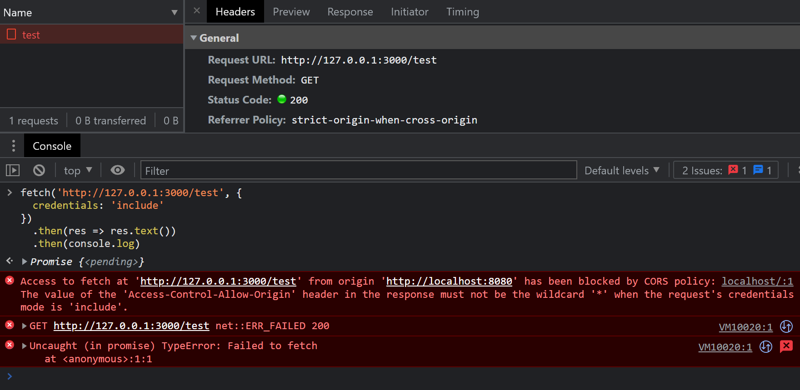

可以观察到新的错误：

```
Access to fetch at 'http://127.0.0.1:3000/test' from origin 'http://localhost:8080' has been blocked by CORS policy: The value of the 'Access-Control-Allow-Origin' header in the response must not be the wildcard '*' when the request's credentials mode is 'include'.
```

从错误中，可以知道，在 `credentials` 模式为 `include` 的时候，之前设置的 `Access-Control-Allow-Origin` 头就不能简单粗暴的设为 `*` 了。

> 注，如果是 PUT 等方法，则再预检时，就能检测出该错误，然后阻止 PUT 请求。而 GET 这种简单请求，则是直接忽视返回的结果。

此时的解决方法就要明确设置 `Access-Control-Allow-Origin` 为跟请求的 `Origin` 对应的值，修改我们的中间件代码测试下：

```js
app.use((req, res, next) => {
  res.header('Access-Control-Allow-Origin', 'http://localhost:8080')
  res.header('Access-Control-Allow-Methods', 'PUT')
  res.header('Access-Control-Allow-Headers', 'x-requested-with')
  res.header('Access-Control-Expose-Headers', 'test-header')
  next()
})
```

再次请求，结果如下：

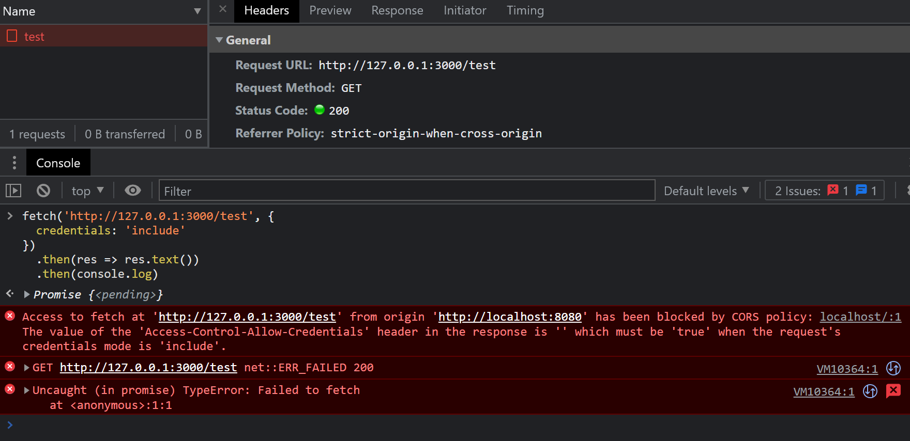

可以看到一个新的错误信息：

```
Access to fetch at 'http://127.0.0.1:3000/test' from origin 'http://localhost:8080' has been blocked by CORS policy: The value of the 'Access-Control-Allow-Credentials' header in the response is '' which must be 'true' when the request's credentials mode is 'include'.
```

从错误中，我们知道，此时响应头还需要设置 `Access-Control-Allow-Credentials` ，将其值设置为 `true`（唯一合法值）。

如果不设置，对于 GET 这种简单的请求，浏览器会直接忽视响应体，而 PUT 等需要预检的请求，则预检的结果会阻止 PUT 的发送。

我们改造中间件继续测试：

```js
app.use((req, res, next) => {
  res.header('Access-Control-Allow-Origin', 'http://localhost:8080')
  res.header('Access-Control-Allow-Methods', 'PUT')
  res.header('Access-Control-Allow-Headers', 'x-requested-with')
  res.header('Access-Control-Expose-Headers', 'test-header')
  res.header('Access-Control-Allow-Credentials', 'true')
  next()
})
```

再次请求后，问题就有解决了：
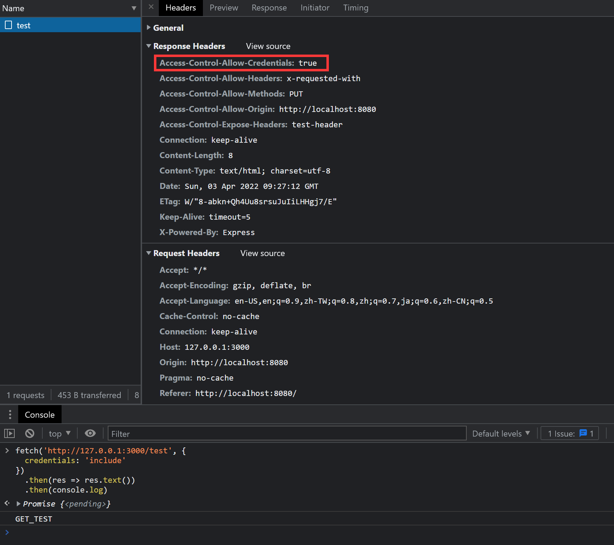

正确打印信息。

## 预检缓存

`Access-Control-Max-Age` 这个 header 用来控制预检的缓存，对于同样的请求，每次都发起一个 OPTIONS 请求并无必要，所以，可以通过这个 header 来控制 OPTIONS 预检请求的频率。


## 参考资料
- [Preflight request](https://developer.mozilla.org/en-US/docs/Glossary/Preflight_request)

全文完
