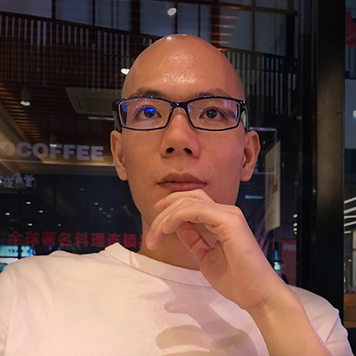

## 我是 Dawenci

  

  朋友通常喊我大文、大D、老D。 
  是个设计出身的前端工程师。 

  

* 生活上是个 Ukulele、木吉他、画画爱好者。
* 果粉，某些方面会死扣细节，追求完美。
* Google 重度依赖，科学上网多年。

---

## 我的开源项目：

* [blocks](https://dawenci.me/blocks/)
  一个面向未来的 Web Components 组件库。

* [ijs](https://github.com/dawenci/ijs)
  一个类似 lodash 的高效率函数式编程工具库。

* [乐理](https://github.com/dawenci/d-music)
  一个乐理相关的基础函数库。

---

## 我的技术栈

我主要但不仅限于使用这些：

* JavaScript ( ES3 - ES6 ), TypeScript
* HTML ( xHTML, HTML5 )
* CSS ( SCSS, LESS )
* Vue 技术栈, Backbone, jQuery ( Zepto ), Lodash ( Underscore )
* Webpack, Rollup, Babel, Gulp, Browserify
* Node.js, Express, MongoDB, Mongoose
* Git, SVN
* Photoshop, Illustrator
